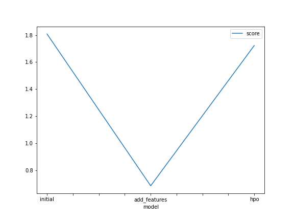

# Report: Predict Bike Sharing Demand with AutoGluon Solution
#### Caleb M. Cook

## Initial Training
### What did you realize when you tried to submit your predictions? What changes were needed to the output of the predictor to submit your results?
Needed to ensure it was a series with non-negative entries.

### What was the top ranked model that performed?
The model where we added datatime related features

## Exploratory data analysis and feature creation
### What did the exploratory analysis find and how did you add additional features?
I added features for Year, Month, Day, and hour. The EDA did not add substantially due to time contraints.

### How much better did your model preform after adding additional features and why do you think that is?
It performed much better, as you can see below.

## Hyper parameter tuning
### How much better did your model preform after trying different hyper parameters?
It performed worse

### If you were given more time with this dataset, where do you think you would spend more time?
Additional feature engineering.

### Create a table with the models you ran, the hyperparameters modified, and the kaggle score.
model       |hpo1              |score
initial     |na	               |1.80721
add_features|na	               |0.68446
hpo	        |num_bag_folds=5   |1.72268

### Create a line plot showing the top model score for the three (or more) training runs during the project.

TODO: Replace the image below with your own.

### Create a line plot showing the top kaggle score for the three (or more) prediction submissions during the project.

TODO: Replace the image below with your own.

## Summary
No comment.